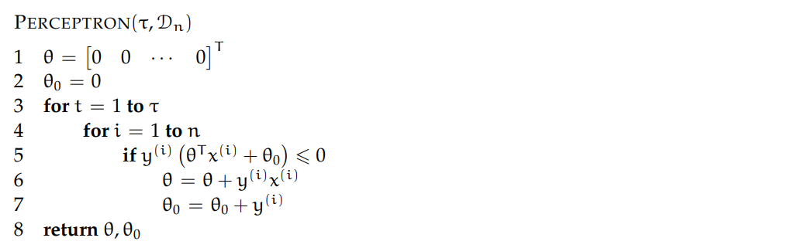
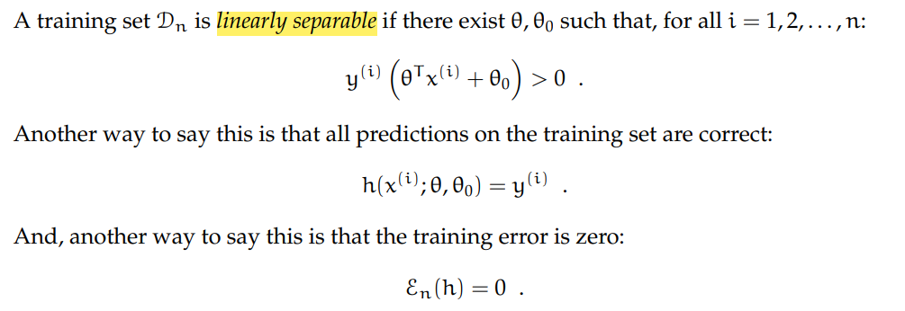
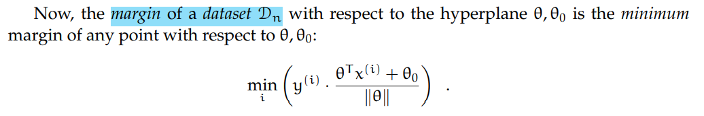
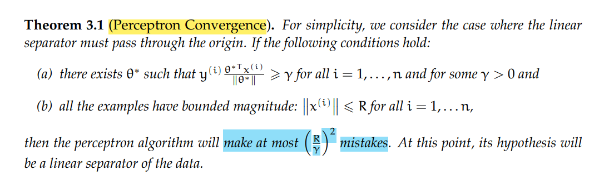

# 6.036 Week2

## Chapter 2 The Perceptron Algorithm

### 1. Algorithm

### 2. Theory of the Perceptron

#### 2.1 Linear Separability

#### 2.2 Margin

It's like roughly how right are we. If it's negative, we're not very right.

### 2.3 Perceptron Convergence

