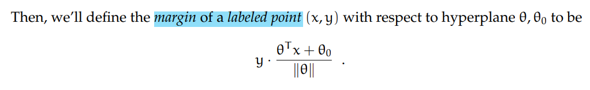

# 6.036 Week2

## Chapter 2 The Perceptron Algorithm

### 1. Algorithm

### 2. Theory of the Perceptron

#### 2.1 Linear Separability

#### 2.2 Margin

It's like roughly how right are we. If it's negative, we're not very right.

### 2.3 Perceptron Convergence

感知机算法保证了，在数据集 linear separable 的情况下能够将数据集的 0-1 loss 降为 0
